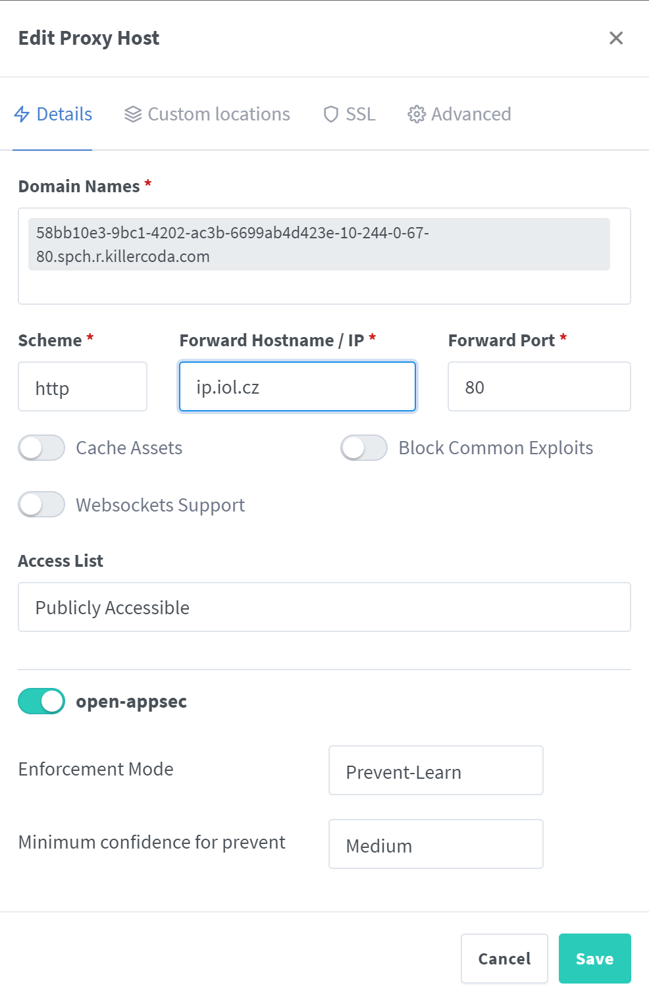

# Step 2

Your [NGINX Proxy Manager UI]({{TRAFFIC_HOST1_81}}) is running on port 81. 
Click the [link]({{TRAFFIC_HOST1_81}}) to open it.

At first login please use the following default administrator user credentials:

E-mail address: `admin@example.com`{{copy}}
Password: `changeme`{{copy}}

You will be prompted to change the password.

To learn how to use NGINX Proxy Manager (NPM) see project documentation: https://nginx-proxy-manager.com (NPM configuration will not be explained here).

### open-appsec integration with NGINX Proxy Manager

We will be creating new Proxy host for incoming URL {{TRAFFIC_HOST1_80}}

IMPORTANT: Killecoda is terminating TLS on port 443 and forwarding traffic to NGINX Proxy Manager on port 80. This is why we will be using port 80 for incoming traffic and URL as seen by nginx and open-appsec is HTTP one.

Use http to ip.iol.cz on port 80 as target (protected) URL of our new reverse proxy configuration.
Direct access to this service is http://ip.iol.cz/

Use Hosts / Proxy Hosts menu to create new Proxy Host:

Once you created a new Proxy Host within NGINX Proxy Manager WebUI you can now easily enable and configure open-appsec protection (see also screenshot below):

* Enable open-appsec by flipping the “open-appsec” switch to enabled.

* Select the Enforcement Mode, it can be either “Prevent-Learn” or “Detect-Learn”

* Select the minimum confidence level for open-appsec to prevent an attack (only relevant when in prevent mode), it can be either “Critical”, “High” or “Medium” confidence.

* Click “Save”

Once you apply new host configuration, it would be accessle on [link]({{TRAFFIC_HOST1_80}}) URL. Try.

We will check if open-appsec is working in the next step.

