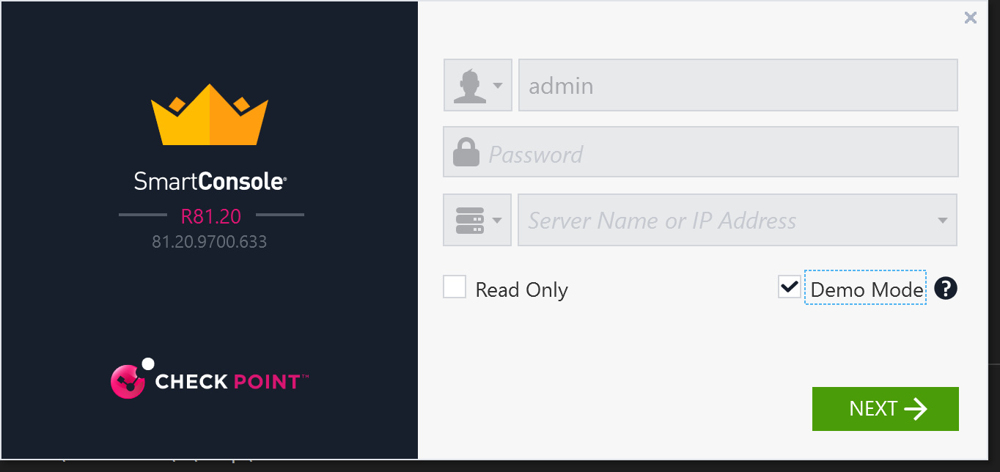
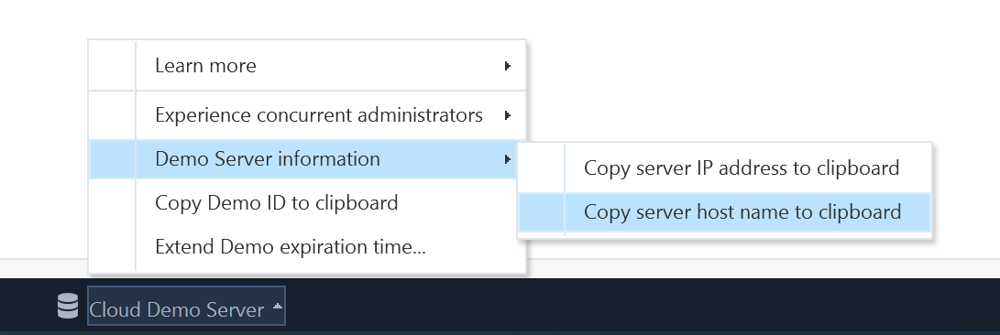
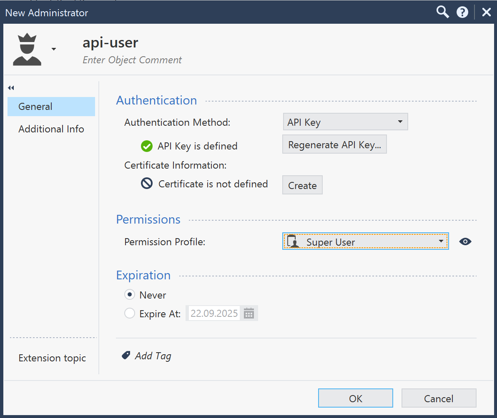

### API access to SmartConsole Demo Server

Open SmartConsole R81.20 Demo Mode


Note management server host name at the bootom of SmartConsole window
in Cloud Demo Server menu.


Create new user authenticated by API key 
in Manage & Settings -> Permissions & Administrators -> Administrators.
User name: api-key
Authentication method: API Key
Generate and note the key with "Copy Key to Clipboard" 
Permission Profile: Super User


Remember to Publish the changes.

Now we are able to talk to management server with API key.

Modify and execute with your values:
```bash
export CPSERVER="demozo8viugfh3.mgmt.cloud"
export CPKEY="sXLL47vN1nX5NaoB8myODw=="
```{{copy}}

Verify credentials:
```bash
curl -X POST -H "Content-Type: application/json" -d "{\"api-key\":\"${CPKEY}\"}" "https://${CPSERVER}/web_api/login" 
```{{exec}}
