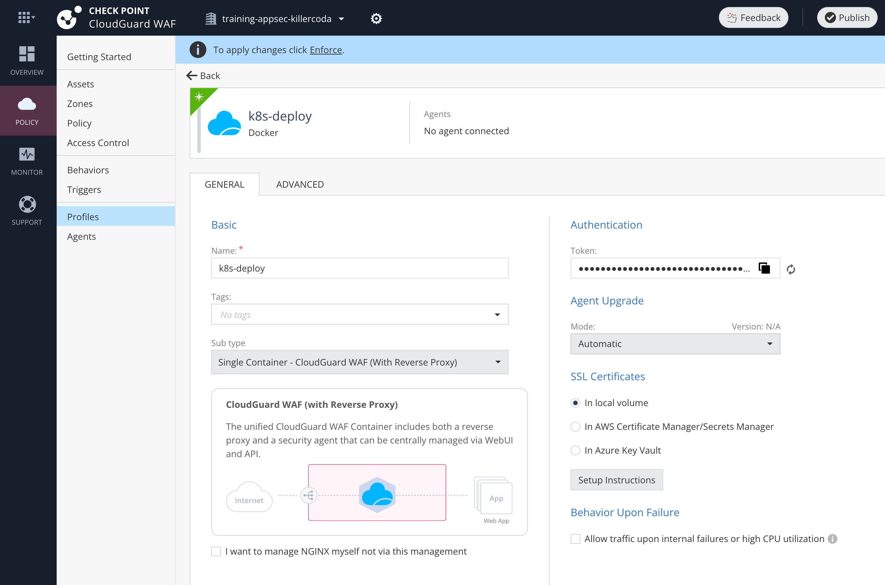

# Create Docker profile - single container, managed

* make sure profile is of type Docker
* choose Single Container
* Managed - do **not** check "I want to manage NGINX myself"
* copy profiles' Token to clipboard

Type `CPTOKEN=cp-123xxx`{{copy}} with your very own token.

And store it as Kubernetes Secret using command `kubectl create secret generic appsec --from-literal=cptoken=$CPTOKEN`{{exec}}

Check it: `kubectl describe secret appsec`{{exec}}

