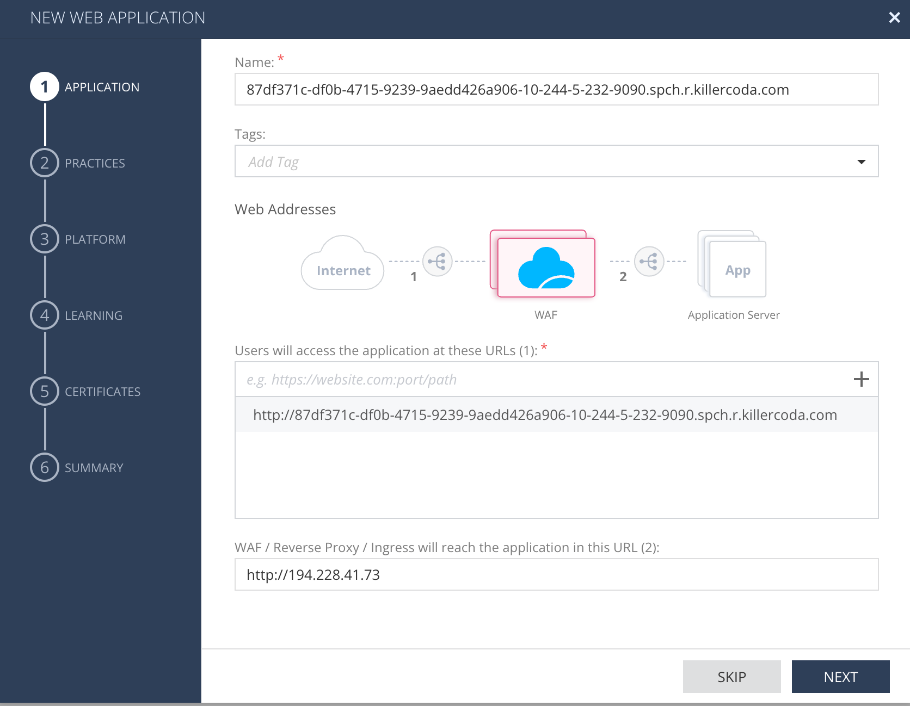

# Asset

Lets create new Web Application [Aseet](https://portal.checkpoint.com/dashboard/appsec#/waf-policy/assets/)

* name asset by your host e.g. 87df371c-df0b-4715-9239-9aedd426a906-10-244-5-232-8080.spch.r.killercoda.com
* users will access by URL e.g. http://87df371c-df0b-4715-9239-9aedd426a906-10-244-5-232-8080.spch.r.killercoda.com
    * make sure it is HTTP
    * no trailing / character
* WAF will reach the app on this URL: `http://194.228.41.73`{{copy}}
* choose PREVENT
* chose your existing Docker profile - e.g. k8s-deploy
    * this is one with CPTOKEN used in deployment/secret
* finish wizard and publish&enforce

